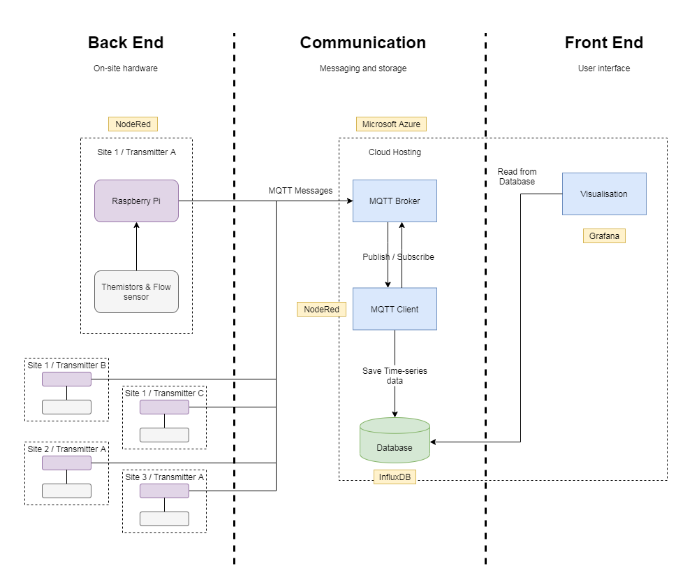

# Architecture Diagram
This diagram shows an overview of the proposed system.

The on-site hardware will include Raspberry Pis that periodically (every 15 minutes) transmit sensor readings from the attached thermocouples and flow sensors to a shared message broker.

Each message will contain:
- The region/site/transmitter path that the readings come from 
- The time that the readings were taken
- The flow rate during the readings
- Calibration values for each thermocouple
- The temperature before the test load
- The temperature after the test load
- The calculated power

These messages are automatically saved from the broker into storage, where they are later loaded into a visualisation suite for display to a user. The visualisation component will also handle monitoring values and alerts. 
