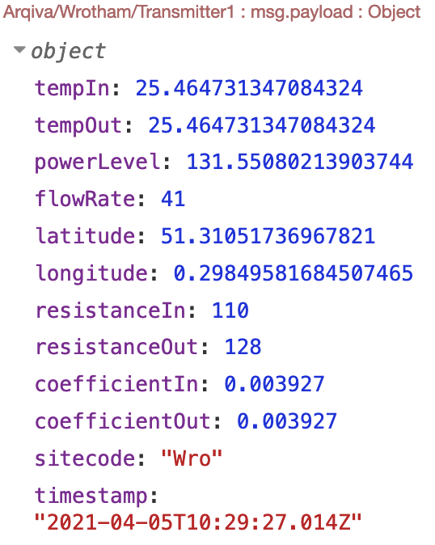

#This is an example message that will be sent to the influxDB from the Raspberry Pi from the site.

---

The site and transmitter name can be configured on the Raspberry Pi which will change the message topic accordingly.

---

